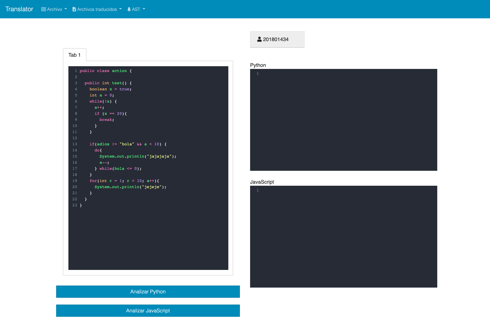

# Translator in Docker
---

Como programadores a veces (no siempre) queremos usar la tecnología o lenguaje de programación que es más reciente o popular. Ya que usualmente, son los que tienen más información a la mano. Es por eso, que trabajar con sistemas heredados y querer replicar su funcionalidad con un lenguaje más actual o popular, se opta por la traducción de este mismo.

Es por eso que se da la solución de dos traductores que tienen como entrada un lenguaje fuente en Java y que su salida es su respectiva traducción en JavaScript y Python. Esto para darle al usurio más de una opción de salida.

---

### Descripción de la Aplicación 
Es un aplicación web, que se encuentra implementada mediante tres contenedores, cuya razón es simular su funcionamiento en distintas computadoras. Cada uno con un servidor propio.


Cuenta con una interfaz gráfica amigable, se puede definir como una página web estática, ya que no tiene mayor funcionalidad. 

#### Menú
El menú consta de las siguientes acciones:
|  **Archivo**    | Archivo Traducido |  AST        |
| ----------- | ----------------- | ----------  |
| Abrir       |     Ambos         |  JavaScript |
| Guardar     |   JavaScript      |  Python     |
| Guardar Como|     Python        |     -       | 

El usuario será capaz de ingresar el código fuente dentro de un editor de código y a lado dos terminales que muestran errores sintácticos (si es que surgen).



Dos botones para analizar en cada lenguaje. Un menú en la parte superior, donde el usuario será capaz de descargar los reportes del árbol de análisis sintáctico y la salida, que es la traducción resultante de cada lenguaje. Puede abrir o guardar un nuevo archivo que será plasmado dentro del editor de código y listo para traducirse. De no analizarse correctamente, como se mención, en las terminales se mostrará el error y no será posible traducir y generar el AST.

```JavaScript

class ejemplo {
    constructor() {}

    function accion() {

        while (x != "FALSE") {
            a = 1;

        }
        if (!a) {

            return 1;

        }
        if (adios != "hola" && a < 200) {

            do {
                console.log("jajajaja")
            } while (hola > 100);

        }
        for (var a = 1; a < 20; a++) {
            var a = 1;
        }
        return 0;

    }
}
```

Esto es un ejemplo de la salida de código emitida por el traductor de Java a JavaScript, realizando primeramente el análisis correspondiente. Sintáctico y léxico.

A continuación, un ejemplo de salida del AST generado a partir de una entrada *Java*:


Este mismo procesos aplica para la generación del archivo traducido en lenguaje Python.

Cabe mencionar que para hacer funcionar la aplicación, debe de ejecturse el siguiente comando: *docker-compose up*. Permite levantar los servidores configuradas para cada uno de los servidores, así, funcionar multiples contenedores relacionados simultaneamente. Esto logra manter un proyecto compacto y capaz de ser ejecutado en cualquier ordenador.

